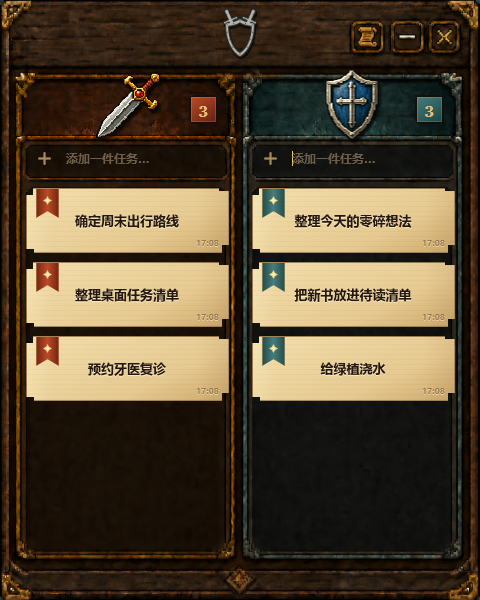
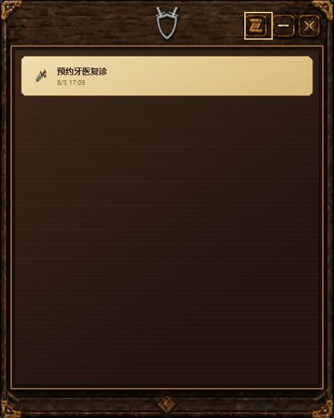

<p align="center">
  
</p>

<h1 align="center">剑盾纪事</h1>

<p align="center">
  一款安静待在 Windows 桌面的双分组任务看板。纯本地、不抢焦点，用剑与盾整理需要推进和需要守住的事情。
</p>

<p align="center">
  A passive, local-first desktop widget, task manager and two-column kanban board for Windows.
</p>

<p align="center">
  <a href="https://github.com/wp-i/sword-shield-chronicle/releases/latest"></a>
  <a href="https://github.com/wp-i/sword-shield-chronicle/actions/workflows/ci.yml"></a>
  
  
  <a href="LICENSE"></a>
</p>

## 亮点

- **真正不打扰的桌面组件**：默认位于普通窗口下方，不置顶，不进入任务栏与 Alt+Tab；只有明确编辑文字时才获取焦点。
- **看板与图标两种形态**：`480 × 600` 双栏看板可缩成 `52 × 52` 单 Logo，单击即可恢复。
- **剑与盾的双分组心智**：两个固定分组分别承载“主动推进”和“持续守住”的任务，不用维护复杂标签体系。
- **快速整理**：分组内添加、直接编辑、同组排序和跨组拖拽都在一块小看板里完成。
- **纯本地、无账号**：任务、顺序和移除历史保存在本机 SQLite；没有云端、账户、追踪或协作服务。
- **克制的移除流程**：两次点击确认移除，避免弹窗打断；移除后进入只读历史，仍可回看行动轨迹。
- **完整 Windows 使用入口**：NSIS 安装包、桌面快捷方式、开始菜单入口和当前用户开机启动。

## 截图

| 主看板 | 移除历史 |
| --- | --- |
|  |  |

## 下载与安装

前往 [Releases](https://github.com/wp-i/sword-shield-chronicle/releases/latest) 下载 `剑盾纪事_*_x64-setup.exe`，双击安装即可。

当前为早期预览版，仅提供 Windows x64 安装包。安装包尚未购买代码签名证书，Windows 可能显示来源提示；请只从本仓库 Release 下载并核对发布页哈希。

关闭程序后，可以通过桌面快捷方式或开始菜单再次启动。安装后默认加入当前用户的开机启动项。

## 使用方式

1. 在剑或盾所在栏输入任务，按 `Enter` 添加。
2. 双击任务标题进行编辑。
3. 拖动卡片调整顺序，或拖到另一栏切换分组。
4. 第一次点击卡片右侧斩击按钮进入确认状态，再次点击完成移除。
5. 右上角历史按钮显示或隐藏只读移除历史。
6. 点击最小化按钮进入单 Logo 模式，点击 Logo 恢复看板。

## 技术栈

- Tauri 2 / Rust：Windows 窗口行为、单实例与原生安装包
- React 19 / TypeScript / Vite：界面与交互
- SQLite / rusqlite：本地持久化的唯一数据源
- dnd-kit：任务排序与跨组拖拽

窗口控制、领域状态和持久化分别维护边界，React 组件只消费快照并提交命令，不作为第二份数据源。

## 本地开发

需要 Node.js、Rust stable、Microsoft C++ Build Tools 和 WebView2。

```bash
npm install
npm run tauri dev
```

常用检查：

```bash
npm test
npm run build
cargo test --manifest-path src-tauri/Cargo.toml
npm run tauri build
```

生成的 NSIS 安装包位于 `src-tauri/target/release/bundle/nsis/`。

## 隐私

剑盾纪事不需要注册账号，也不会主动联网同步任务。应用数据保存在 Tauri 应用标识对应的本地数据目录中。WebView2 缺失时，Windows 安装流程可能需要联网获取运行环境。

## 参与贡献

欢迎提交 Bug、Windows 交互验证记录和聚焦于现有产品边界的改进。开始前请阅读 [CONTRIBUTING.md](CONTRIBUTING.md)。涉及窗口层级、焦点、拖拽、缩放或透明效果的修改，请附真实 Windows 截图或录屏。

## 许可证与素材

源代码和仓库内原创视觉资产以 [MIT License](LICENSE) 发布。直接依赖及其许可证见 [THIRD_PARTY_NOTICES.md](THIRD_PARTY_NOTICES.md)。项目没有打包任何第三方游戏图片、音频、商标或特效素材。
